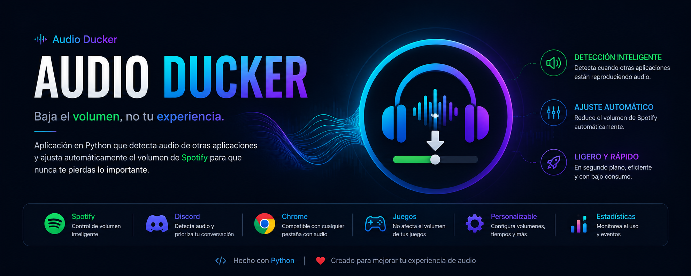

# 🎵 AudioDucker v2.0 para Windows

**AudioDucker** es una aplicación inteligente para Windows que atenúa automáticamente el volumen de tu reproductor de música (**Spotify** por defecto) cuando detecta que otras aplicaciones (**Discord**, **Chrome**, **Firefox**, **Zoom**, **Telegram**, etc.) o tu **Micrófono** están **emitiendo sonido**.

A diferencia de otros programas convencionales, AudioDucker utiliza las APIs de sonido nativas de Windows (WASAPI / PyCAW) para medir los **picos de volumen reales**. Si Chrome o Discord están abiertos pero en silencio, el volumen de Spotify NO bajará. Solo se atenuará en el instante exacto en que comiencen a reproducir audio o cuando comiences a hablar por tu micrófono.

---

## ✨ Novedades en la Versión 2.0

- 🖥️ **Interfaz Gráfica Moderna (GUI)**: Panel visual completo con modo oscuro integrado.
- 📁 **Explorador de Archivos `.exe`**: Botón *"Agregar (.exe)"* para seleccionar cualquier ejecutable desde el Explorador de Windows sin escribir rutas manualmente.
- 🎤 **Atenuación por Micrófono (ON/OFF)**: Casilla/Switch para activar o desactivar la atenuación cuando TÚ hablas por el micrófono, con selector del dispositivo de entrada específico.
- 🎚️ **Control de Transiciones de Volumen**: Elige entre cambios **Instantáneos (0s - de golpe)** o **Desvanecimientos Suaves (0.1s a 2.0s)**.
- 🚀 **Integración de Inicio Automático**: Botón para registrar el ejecutable en la carpeta de Inicio de Windows (`shell:startup`).
- 🎨 **Recursos e Icono Personalizado**: Compilado con icono nativo `assets/logo.ico`.

---

## 📁 Estructura del Proyecto

```
AudioDucker/
├── assets/                  # Iconos y recursos gráficos (banner.png, logo.ico, logo.png)
├── AudioDucker.exe          # Ejecutable listo para usar sin consola
├── main.py                  # Punto de entrada y motor multihilo de atenuación
├── gui.py                   # Interfaz gráfica de usuario con CustomTkinter
├── detector.py              # Medición de picos de sonido de procesos y micrófonos
├── volume_controller.py     # Transiciones instantáneas y suaves de volumen WASAPI
├── config.json              # Configuración persistente en formato JSON
├── create_startup_shortcut.ps1 # Script de inicio automático en Windows
├── requirements.txt         # Dependencias de Python
└── README.md                # Documentación en GitHub
```

---

## 🚀 Instalación y Uso

### Opción 1: Ejecutable listo (`AudioDucker.exe`)
Simplemente ejecuta `AudioDucker.exe`. Se abrirá el panel de control gráfico y el servicio comenzará a funcionar automáticamente en segundo plano.

### Opción 2: Ejecutar desde código fuente en Python
```bash
pip install -r requirements.txt
python main.py
```

---

## ⚙️ Configuración (`config.json`)

Toda la configuración se puede gestionar visualmente desde la GUI o editando `config.json`:

```json
{
  "target_app": "spotify.exe",
  "default_volume": 1.0,
  "default_duck_volume": 0.20,
  "duck_on_microphone": false,
  "selected_microphone": "Default",
  "mic_duck_volume": 0.20,
  "mic_peak_threshold": 0.01,
  "trigger_apps": {
    "discord.exe": 0.25,
    "chrome.exe": 0.35,
    "msedge.exe": 0.35,
    "firefox.exe": 0.35,
    "brave.exe": 0.35,
    "telegram.exe": 0.25,
    "zoom.exe": 0.15,
    "obs64.exe": 0.30
  },
  "transition_duration_seconds": 0.4,
  "release_delay_seconds": 1.0,
  "audio_peak_threshold": 0.005,
  "check_interval_seconds": 0.05
}
```

---

## 🤖 Desarrollo con Inteligencia Artificial

Este proyecto fue concebido, diseñado y desarrollado en par-programming utilizando tecnologías avanzadas de Inteligencia Artificial:

- **Modelo de IA**: **Google Antigravity AI (Gemini 3.6 Flash / Pro)** desarrollado por Google DeepMind.
- **Áreas de automatización**: Integración WASAPI de Windows, multihilo asíncrono, diseño de GUI moderna y empaquetado autónomo.

---

## 📦 Compilación a `.exe`

Para volver a generar el ejecutable `.exe` independiente con icono personalizado:

```bash
pip install pyinstaller
python -m PyInstaller --noconsole --onefile --icon=assets/logo.ico --name "AudioDucker" main.py
```
